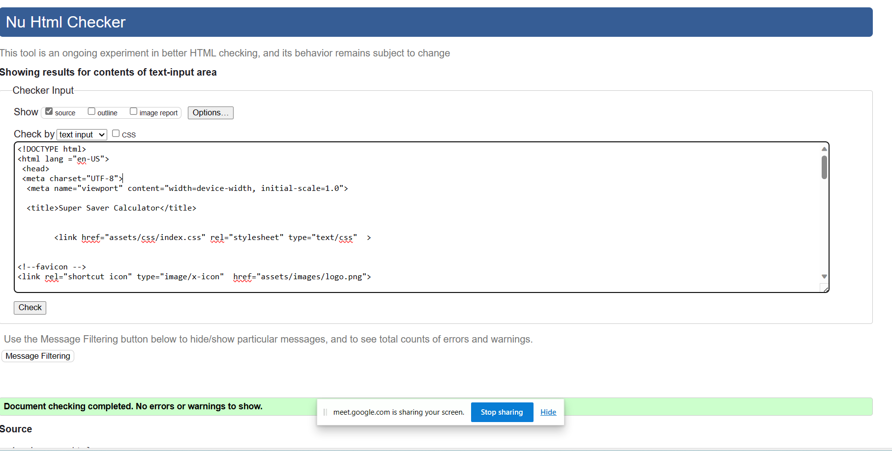
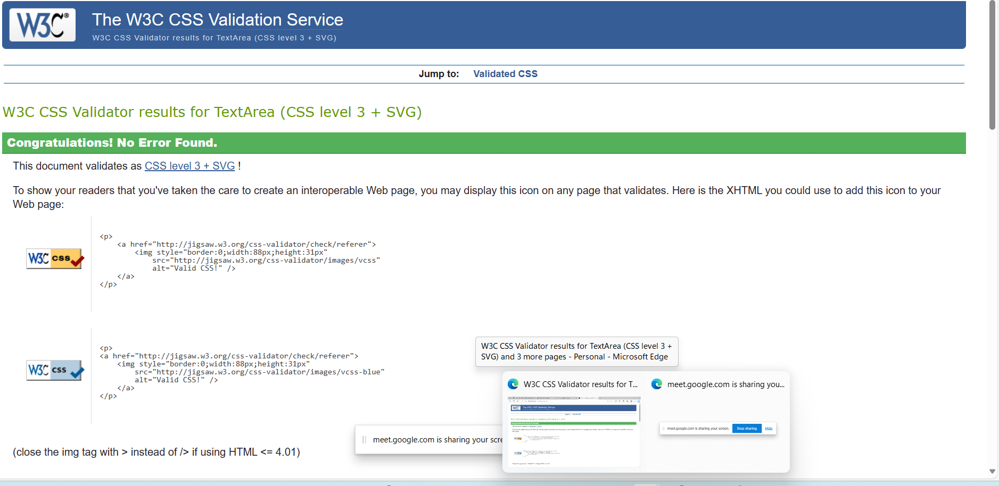

User Stories :
First Time Visitor Goals:
As a First Time Visitor, I want to easily understand the main purpose of the site, so I can learn more about the calculator.
As a First Time Visitor, I want to be able to easily navigate through the website, so I can find the content.
As a First Time Visitor, I want to quickly acces the calculator so I can start Using.

# Super Saver Bank Calculator
 * They are number stores where numbers are stored temporarily while doing calculations.
 * All numbers are working. Addition, Substraction, Multiply, Division, Percentage and done calculation.
 * All function are working correctly.
 * Background Color black
 * Button color white

#####
*  Technologies Used:
*   Html
*   Css
*  Javascript

HTML was used as the foundation of the site.
CSS - was used to add the styles and layout of the site.
JavaScript - used to create the calculator, and to operate the users interaction with the page.
Visual Studio Code was used as the main tool to write and edit code.
Git was used for the version control of the website.
GitHub was used to host the code of the website.
######
As a first-time visitor, I want to understand the purpose of the Website, so I can use it properly.
As a first-time visitor, I want to see what technologies have been used to create the Website, so I can learn more about them and use them myself.
As a user of the Website, I want to see what filters are currently applied on each chart, so I can analyze visualized data correctly.
As a user of the Website, I want to be able to reset applied filters for each chart, so I can switch filters I'm not currently interested in.
As a mobile device user, I want the Website to be mobile-friendly, so I can use my tablet or smartphone to visit it.
####
HTML
Home Page
No errors or warnings were found when passing through the official W3C validator.

CSS
No errors or warnings were found when passing through the official w3c css validator.

No errors showing were found when passing through the jshint .

Flow Chart Screenshot

####
Footer
contains as copyright of Author
CopyRight © 2023 Super Saver Calculator
####
About Calculator :
Main Menu
AC Menu Buttons
Positioned at the center of the page for clear visibility.
19 Buttons
Working and doing calculations.
By clicking the AC button calculator is start we can do adition,substraction,multiplication,division,percentage etc.
It is helping to do  calculation easier.
AC button use for  turn off the calculator.
Press any  1 to 9 number for calculation.
Use any opreator for calculation.
Manual Testing :

There are Addition, Substraction, Multiply, Division, percentage and Eaual opreator.
For Example if you want you can add 1 + 5 = 6
For Example if you want you can Substaction 7 - 5 = 2
For Example if you want you can Multiply 5 * 5 = 25
For Example if you want you can Divide 20 / 5 = 4
For Example if you want you can Percentage 50 % 5 = 2.5
If you want to off press AC

####
Accessibility and performance
Using lighthouse in devtools I confirmed that the website is performing well, accessible and colors and fonts chosen are readable.
Home page:

