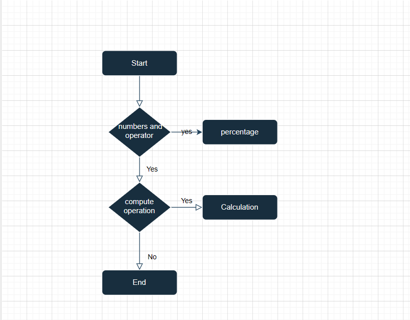

# Super Saver Bank Calculator
 * They are number stores where numbers are stored temporarily while doing calculations.
 * All numbers are working. Addition, Substraction, Multiply, Division, Percentage and done calculation.
 * All function are working correctly.
 * Background Color black
 * Button color white

#####
*  Technologies Used:
*   Html
*   Css
*  Javascript
######
As a first-time visitor, I want to understand the purpose of the Website, so I can use it properly.
As a first-time visitor, I want to see what technologies have been used to create the Website, so I can learn more about them and use them myself.
As a user of the Website, I want to see what filters are currently applied on each chart, so I can analyze visualized data correctly.
As a user of the Website, I want to be able to reset applied filters for each chart, so I can switch filters I'm not currently interested in.
As a mobile device user, I want the Website to be mobile-friendly, so I can use my tablet or smartphone to visit it.
####
HTML
Home Page
No errors or warnings were found when passing through the official W3C validator.

CSS
No errors or warnings were found when passing through the official w3c css validator.

No errors showing were found when passing through the jshint .

Flow Chart Screenshot

####
Footer
contains as copyright of Author
CopyRight © 2023 Super Saver Calculator