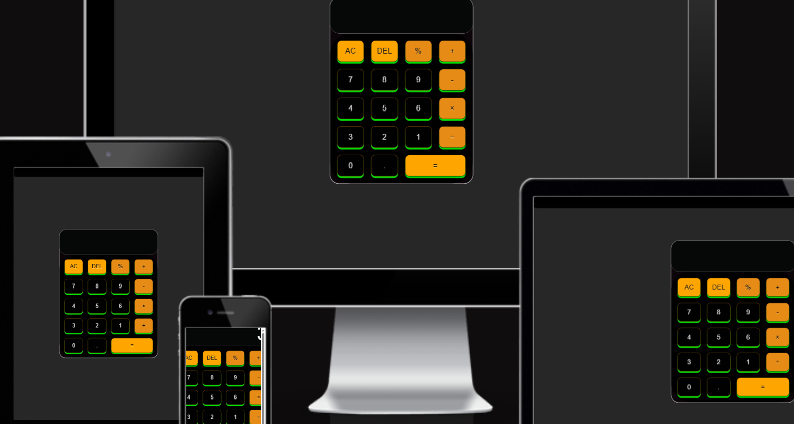
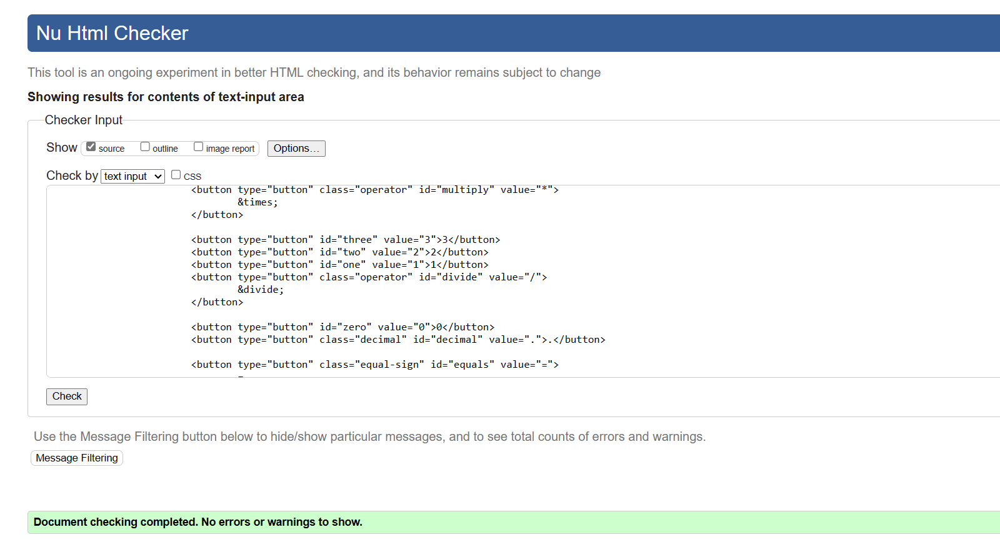
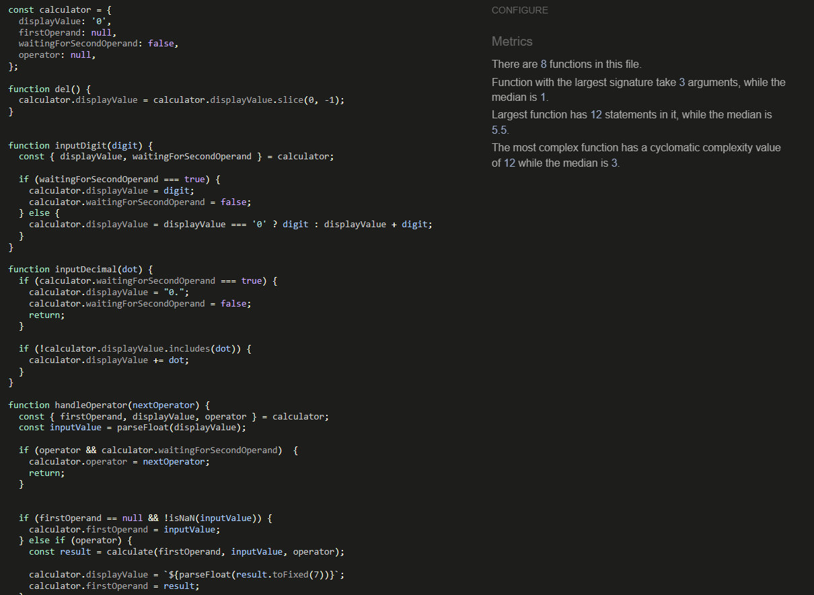
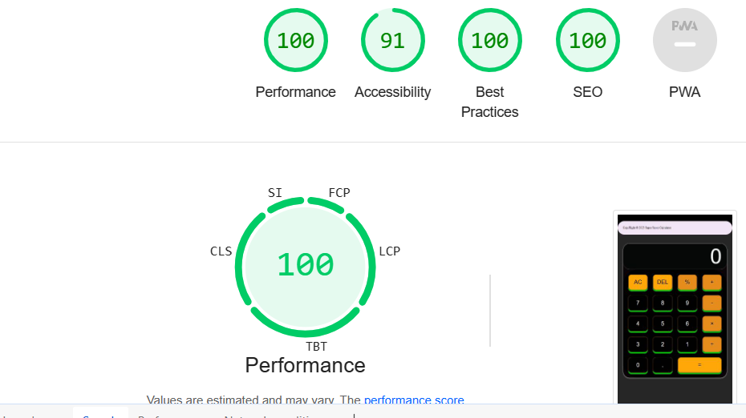
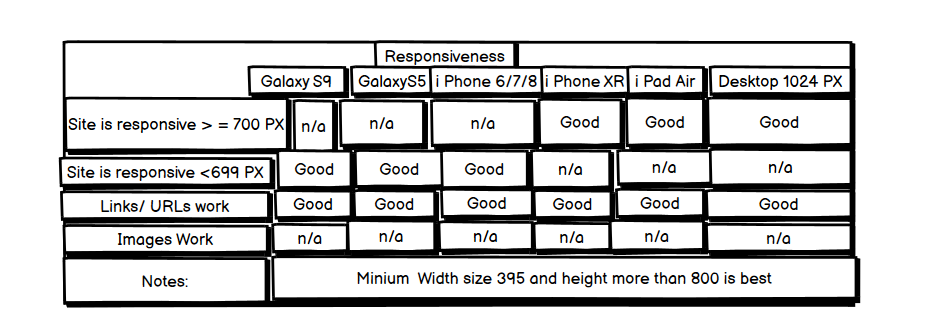
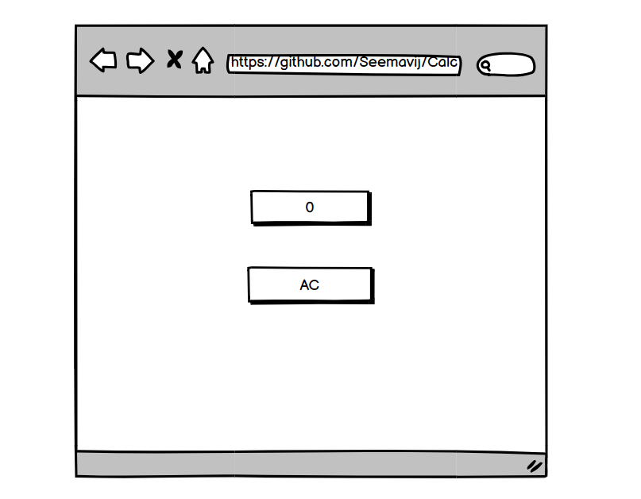
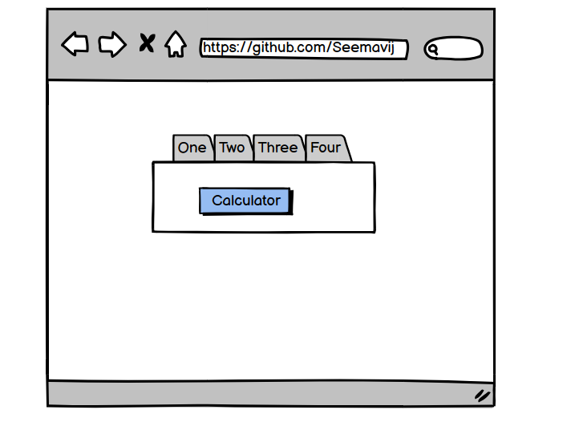

# User Stories :

* First Time Visitor Goals:
* As a First Time Visitor, I want to easily understand the main purpose of the site, so I can show more about the calculator.
* As a First Time Visitor, I want to quickly acces the calculator so I can start Using.
* As a first-time visitor, I want to understand the purpose of the Website, so I can use it properly.
* As a first-time visitor, I want to see what technologies have been used to create the Website, so I can learn more about them and use them   myself.
* As a user of the Website, I want to see what filters are currently applied on each chart, so I can analyze visualized data correctly.
* As a user of the Website, I want to be able to reset applied filters for each chart, so I can switch filters I'm not currently interested in.
* As a mobile device user, I want the Website to be mobile-friendly, so I can use my tablet or smartphone to visit it.

# Super Saver Bank Calculator :
 * They are number stores where numbers are stored temporarily while doing calculations.
 * All numbers are working. Addition, Substraction, Multiply, Division, Percentage and done calculation.
 * All function are working correctly.
 * Background Color black
 * Button color white

# Technologies Used :

*  Html
* Css
* Javascript
* GitHub
* Git
* VS Code
* HTML was used as the foundation of the site.
* CSS - was used to add the styles and layout of the site.
* JavaScript - used to create the calculator, and to operate the users interaction with the page.
* Visual Studio Code was used as the main tool to write and edit code.
* Git was used for the version control of the website.
* GitHub was used to host the code of the website.

####
HTML
Home Page
No errors or warnings were found when passing through the official W3C validator.

CSS
Home page
No errors or warnings were found when passing through the official w3c css validator.

JShint
Home page
No errors showing were found when passing through the jshint .

Flow Chart Screenshot

####

Footer:
* contains as copyright of Author
* CopyRight © 2023 Super Saver Calculator

####
* LOGO
* Calculator
* Name Super Saver Calculator 2023

####
* About Calculator :
* Main Menu
* AC Menu Buttons
* Positioned at the center of the page for clear visibility.
* 19 Buttons
* Working and doing calculations.
* By clicking the AC button calculator is start we can do adition,substraction,multiplication,division,percentage etc.
* It is helping to do  calculation easier.
* AC button use for  turn off the calculator.
* Press any  1 to 9 number for calculation.
* Use any opreator for calculation.

####
Manual Testing :
I confirmed that I done Manual Testing.
* There are Addition, Substraction, Multiply, Division, percentage and Eaual opreator.
* I cofirmed all buttons working correct.
* If you want to off press AC

####
* Accessibility and performance

* Using lighthouse in devtools I confirmed that the website is performing well, accessible and colors and fonts chosen are readable.

####

* Fonts:
* Poppins
* font-family: 'AR One Sans', sans-serif;
* Whereas disregard and contempt for human rights have resulted
* Regular 400 at 48px
* Designed by Robert Leuschke

####

Colour :
* 9d0208 001219 e36414 283618 283618
* 000000 fca311 e5e5e5 f5ebe0 001219
* Black use for base of calculator
* Orange use for AC Button.
* white is use for numbers.
* Green is used for button background.
* Transperent is used for Display

####

Testing :
* In order to confirm the correct functionality, responsiveness, and appearance:
* The website was tested on the following browsers: Chrome, Firefox, Edge.

*

* The website was checked by devtools implemented in Edge and Chrome browsers.

####
Wireframes
* 
* 

Deployment

* The site was deployed to GitHub pages. The steps to deploy are as follows:
* In the GitHub repository, navigate to the Settings tab and then choose pages in the left panel.
* From the source section drop-down menu, select the Main Branch, then click "Save".
* The page will be automatically refreshed with a detailed ribbon display to indicate the successful deployment.
* The live link can be found here.

####
Local Deployment
* In order to make a local copy of this project, you can clone it. In your IDE Terminal, type the following command to clone my repository:

git clone 

Alternatively, if you use Gitpod, you can click here, which will start the Gitpod workspace for you.

Future improvements
Add play against computer option
Media
*  Google Fonts
*  Favicon
*  Tools
*  I loveimages was used to resize GIF images.
*  cooler was used to create the color palette.
*  Am I responsive was used for responsive mockup png.
*  Balsamiq was used to make wireframes for the website.
*  image optimizer was used to resize images.
*  Flowchart Maker & Online Diagram Software for flowchart creation.
*  Website Mockup Generator Was used to create the responsive Mockup png for Readme file visualisation.
####
Acknowledgments
* Code Institute there Code Institute course material in html CSS and java Script and the Slack community members for their  help and support.
* Laura Who helped me  to make some challanges easier.
* Aleksei Konovalov my Code Institue tutor who helped me .

####
About :
* This is a Calculator using for Calculation.